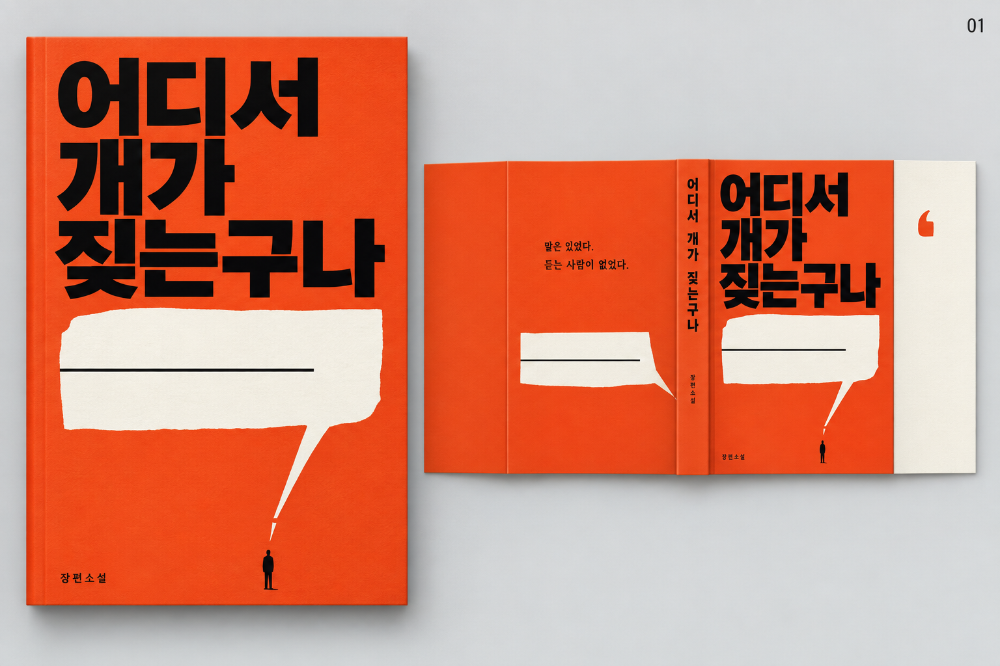
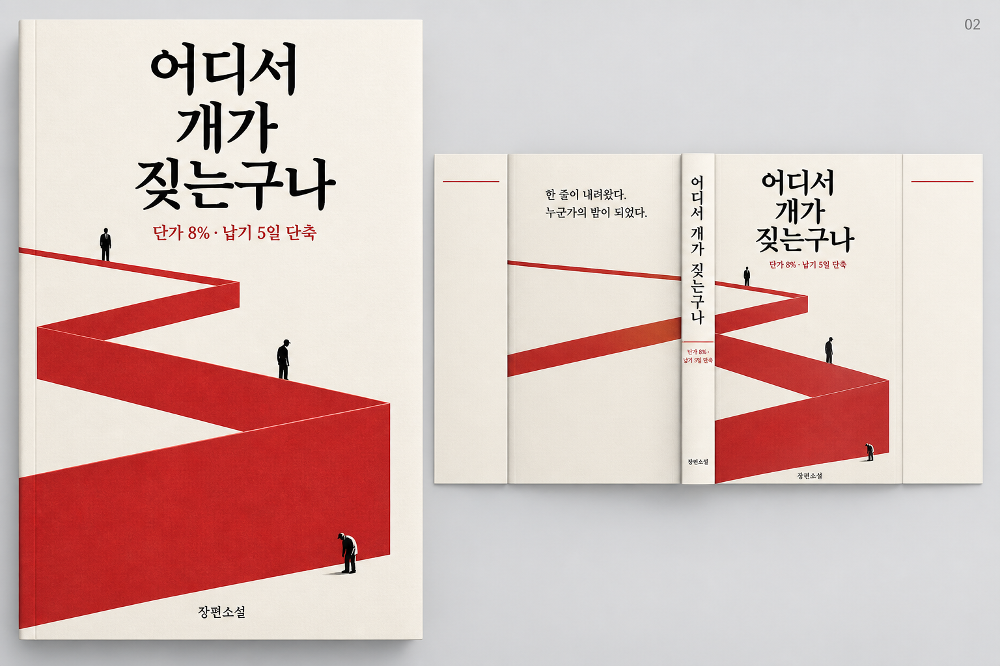
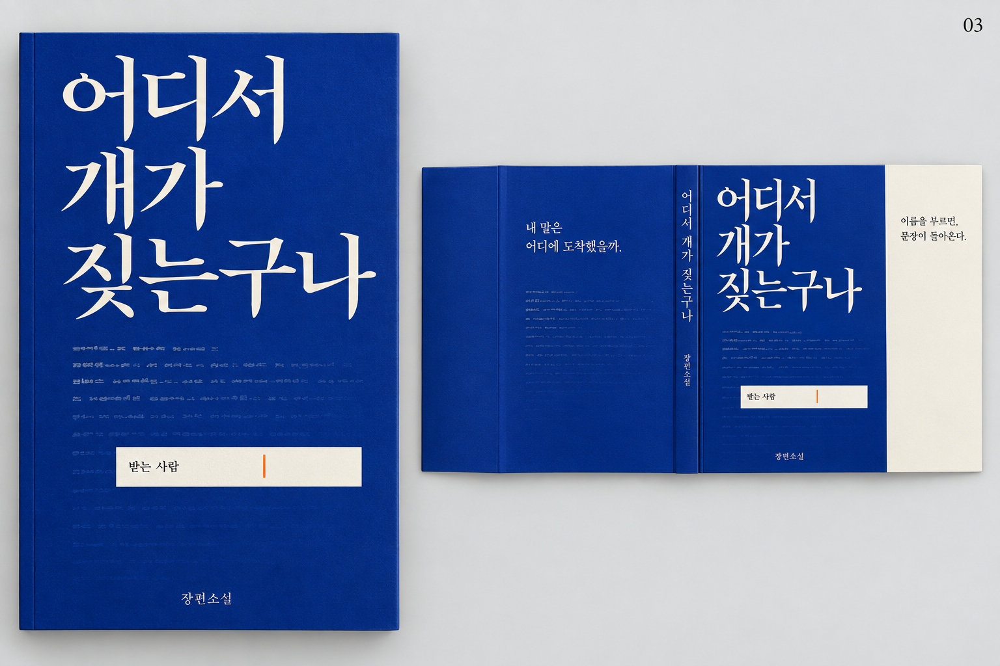
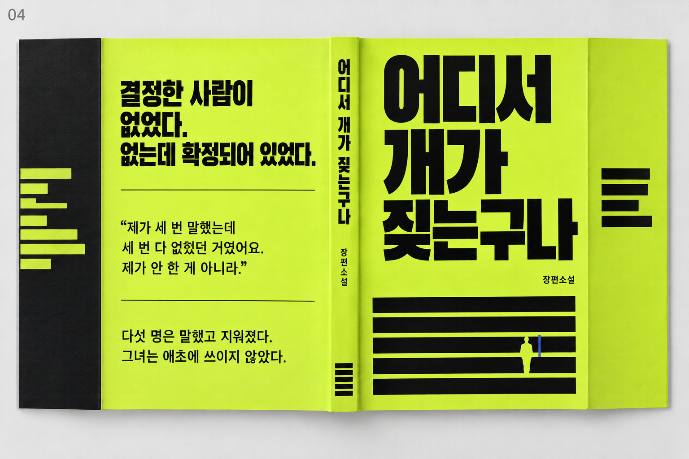
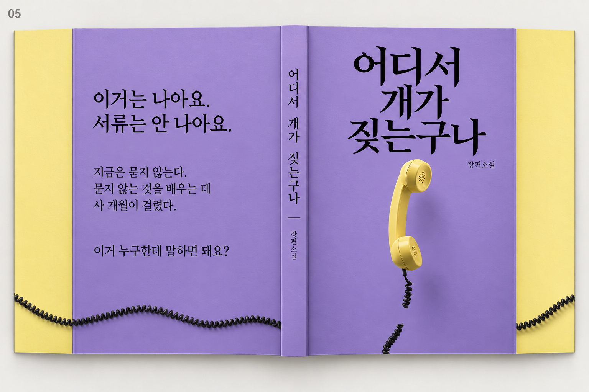
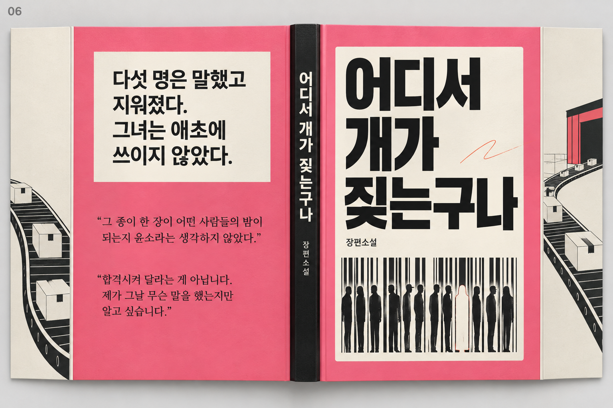
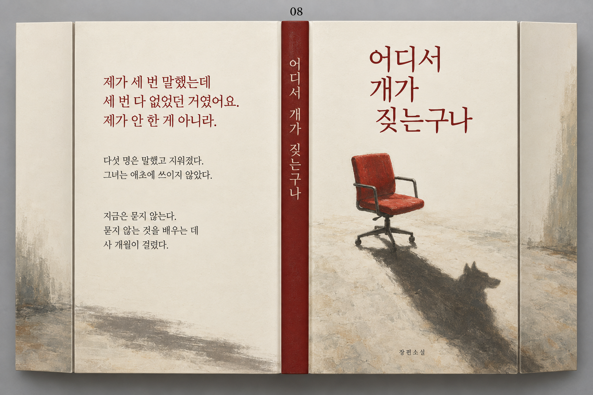
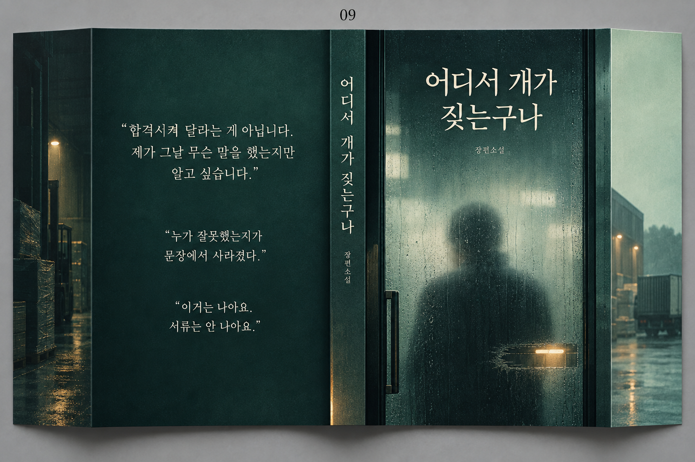

# 《어디서 개가 짖는구나》 표지 디자인 시안

**[최신 페이퍼백 수정안 9종 보기](paperback/README.md)** — 얇은 책등, 이희근·짜임 표기, 스포일러 없는 뒷표지 줄거리 반영.

신국판·날개 있는 표지를 위한 콘셉트 시안 9종. 2026년 9월 12일 내장 이미지 생성 도구로 제작했습니다.

이미지를 클릭하면 원본을 크게 볼 수 있습니다. 현재 파일은 콘셉트 비교용 목업이며, 인쇄용 표지 PDF가 아닙니다. 최종 제작 시 제목·발췌문을 실제 서체로 조판하고 교정한 뒤, 제작 템플릿과 최종 쪽수에 맞춰 책등·날개·재단 여백을 확정해야 합니다.

## 한눈에 보기

| 01–03 | | |
| --- | --- | --- |
| **01 · 도착하지 않는 말**  | **02 · 한 줄의 무게**  | **03 · 당신의 이름을 읽는 순간**  |
| **04 · 사라지는 기록**  | **05 · 연결되지 않는 수화기**  | **06 · 이름 없는 배송 라벨**  |
| **07 · 같은 밤, 다른 층**  | **08 · 빈 의자의 그림자**  | **09 · 유리 너머의 사람**  |

## 개별 시안

01–03은 앞표지 확대와 전체 펼침을 함께 보여줍니다. 04–09는 뒷날개 → 뒷표지 → 책등 → 앞표지 → 앞날개 순서의 펼침입니다. 01–03의 소개 문구는 콘셉트 카피이며, 04–09의 뒷표지 문구는 원고 발췌를 바탕으로 구성했습니다.

### 01 · 도착하지 않는 말

주황색과 빈 말풍선으로 전달되지 않는 목소리를 표현.

### 02 · 한 줄의 무게

아래로 갈수록 거대해지는 붉은 띠로 지시의 무게를 표현.

### 03 · 당신의 이름을 읽는 순간

청색 바탕의 흐릿한 문장과 또렷한 수신자 칸.

### 04 · 사라지는 기록

라임색과 검정 문서 줄 사이에서 누락되는 사람.

### 05 · 연결되지 않는 수화기

보라색 바탕과 끊어진 노란 수화기로 수신자의 부재를 표현.

### 06 · 이름 없는 배송 라벨

분홍색 배송 라벨과 사람으로 변하는 바코드.

### 07 · 같은 밤, 다른 층

사무실·공장·야간 창고를 하나로 잇는 도시의 밤.

### 08 · 빈 의자의 그림자

빈 붉은 의자 아래 남은 개의 그림자로 권력과 부재를 표현.

### 09 · 유리 너머의 사람

짙은 녹색 유리 너머의 흐린 사람과 선명한 글자의 대비.

