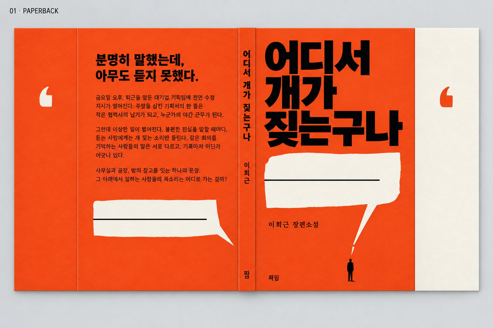
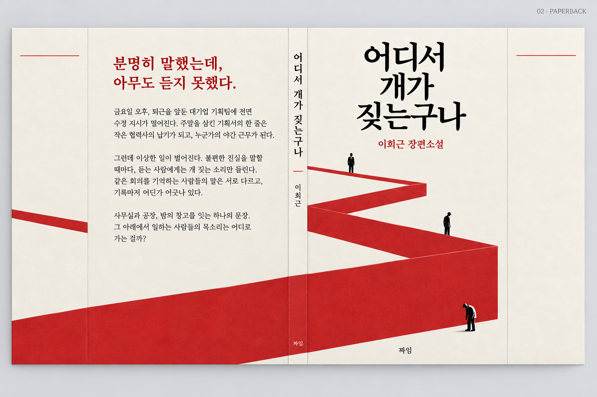
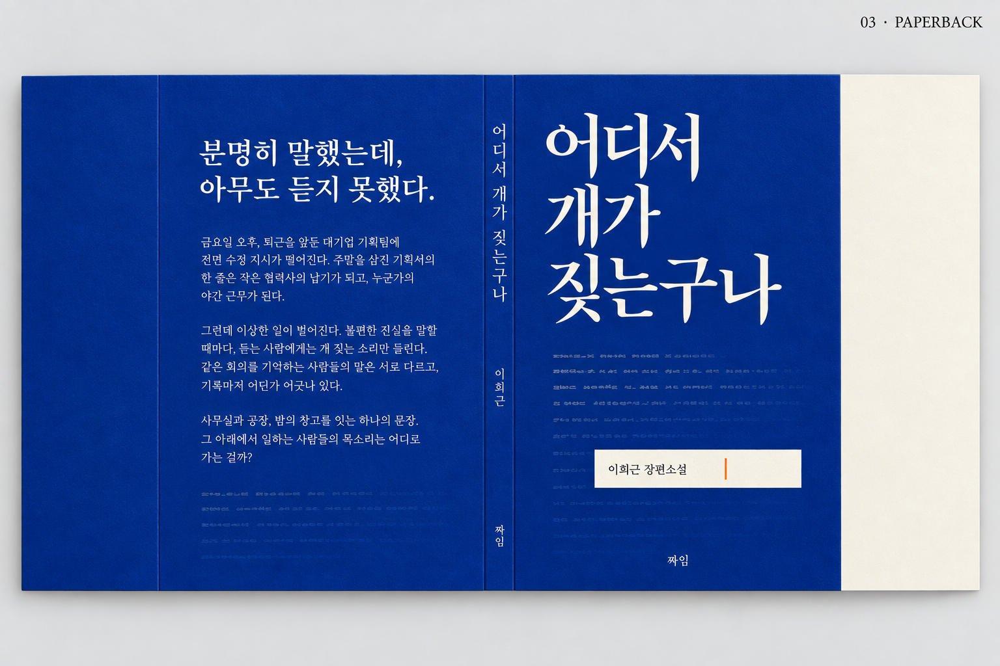
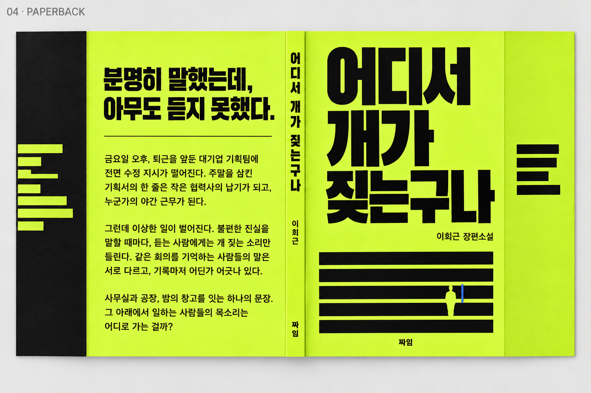
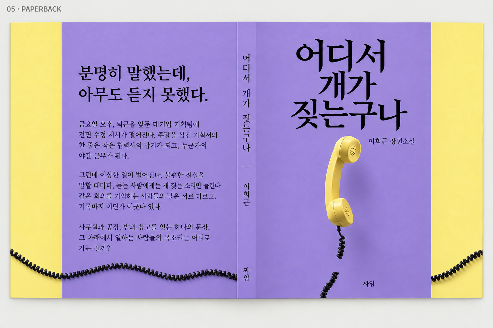
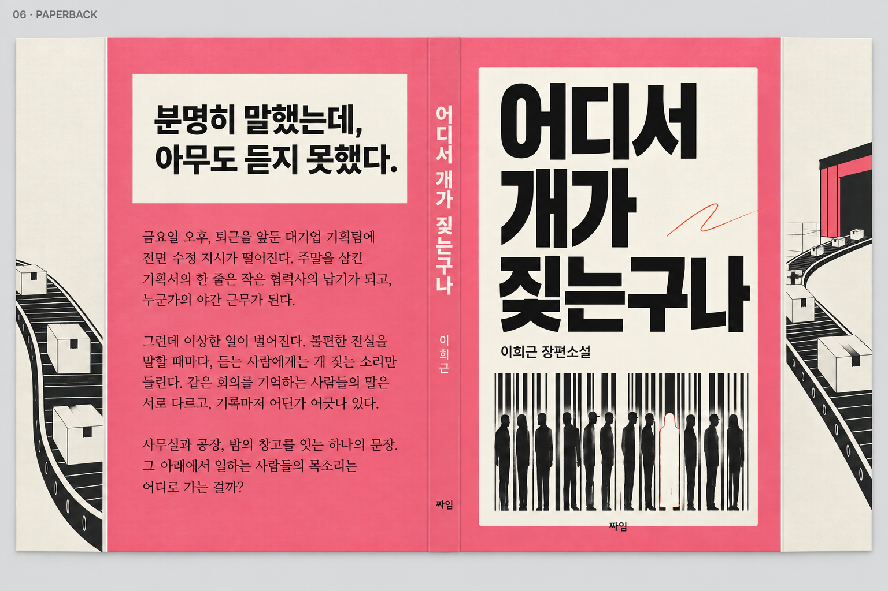
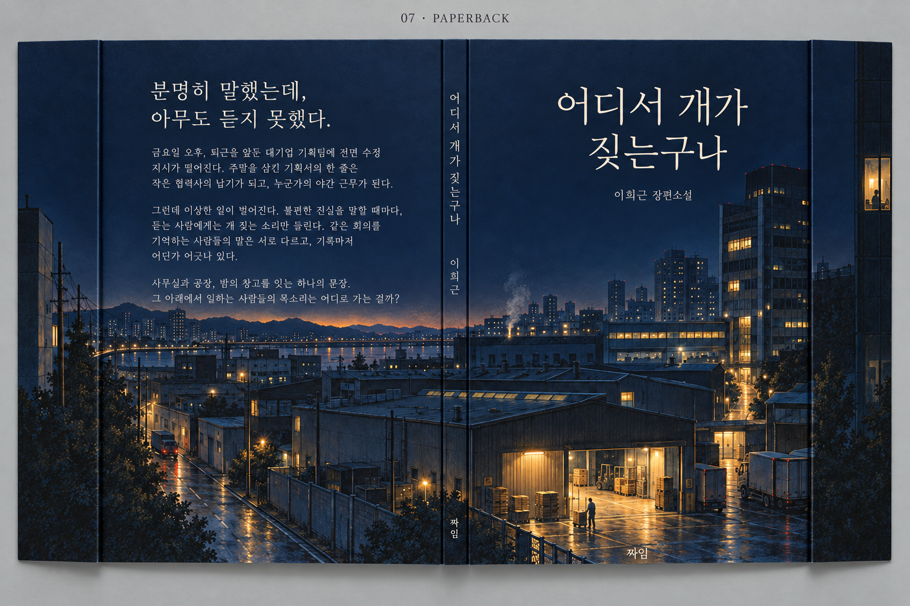
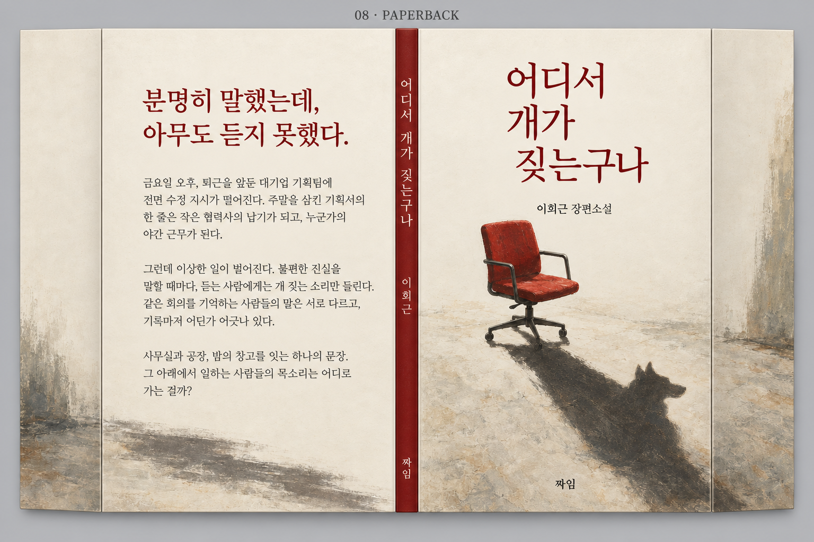
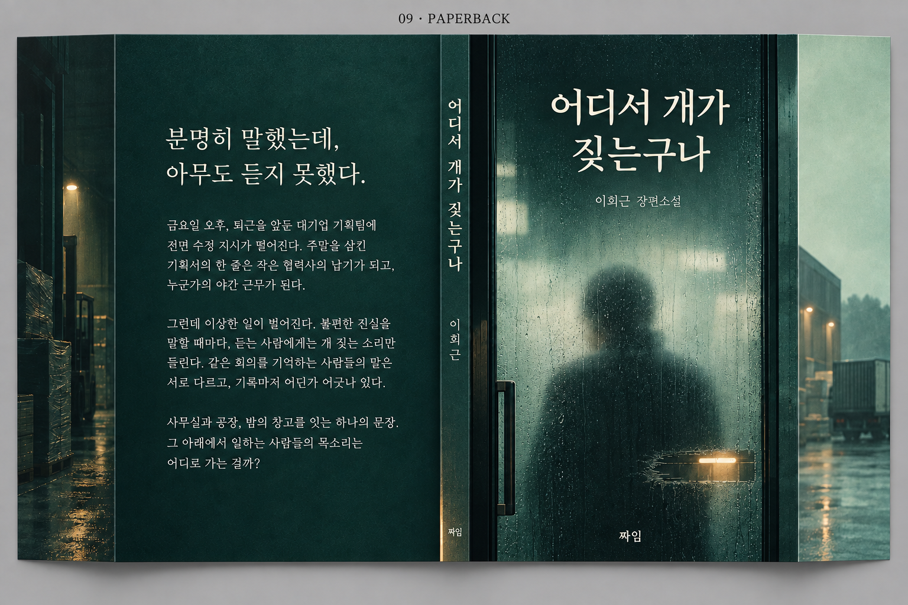

# 페이퍼백 표지 수정안 9종

《어디서 개가 짖는구나》 · 이희근 장편소설 · 짜임

2026-09-13 수정. 기존 9개 시안을 내장 이미지 생성 도구의 편집 기능으로 수정했습니다. 앞표지와 책등에 제목·저자·출판사를 표시하고, 뒷표지는 결말과 반전을 밝히지 않는 줄거리 소개로 통일했습니다.

[브라우저 비교 갤러리](index.html) · [편집 프롬프트와 가정](prompts.json) · [이전 시안](../README.md)

## 판형과 책등

- 신국판 152 × 225mm, 날개 있는 페이퍼백.
- 확인한 부별 PDF: 1부 80쪽, 2부 70쪽, 3부 75쪽, 합계 225쪽. 부별 표제지를 포함한 수치이며 최종 단권의 인쇄 쪽수는 미확정입니다.
- 책등 12mm, 날개 각각 60mm는 **비교용 가정**입니다. 종이 한 장 0.10mm를 가정하면 약 113장 × 0.10mm = 11.3mm이며, 표지 등 여유를 고려해 시안에서는 약 12mm를 목표로 잡았습니다. 이는 교보 확정 규격이 아닙니다.
- [교보 표지 제작 안내](https://store.kyobobook.co.kr/pod/notice/1002427)의 계산 기능으로 최종 용지·쪽수에 따른 책등을 확정해야 합니다.
- PNG는 생성형 이미지로 만든 시각적 제안입니다. 실제 치수·접지선과 작은 글자의 형태는 정밀 조판을 보장하지 않으며, 최종 선정 후 원문으로 재조판·교정하고 인쇄용 PDF를 제작해야 합니다.

## 뒷표지 원문

분명히 말했는데, 아무도 듣지 못했다.

금요일 오후, 퇴근을 앞둔 대기업 기획팀에 전면 수정 지시가 떨어진다. 주말을 삼킨 기획서의 한 줄은 작은 협력사의 납기가 되고, 누군가의 야간 근무가 된다.

그런데 이상한 일이 벌어진다. 불편한 진실을 말할 때마다, 듣는 사람에게는 개 짖는 소리만 들린다. 같은 회의를 기억하는 사람들의 말은 서로 다르고, 기록마저 어딘가 어긋나 있다.

사무실과 공장, 밤의 창고를 잇는 하나의 문장. 그 아래에서 일하는 사람들의 목소리는 어디로 가는 걸까?

## 전체 비교

| 01–03 | | |
| --- | --- | --- |
| **01 · 도착하지 않는 말**  | **02 · 한 줄의 무게**  | **03 · 당신의 이름을 읽는 순간**  |
| **04 · 사라지는 기록**  | **05 · 연결되지 않는 수화기**  | **06 · 이름 없는 배송 라벨**  |
| **07 · 같은 밤, 다른 층**  | **08 · 빈 의자의 그림자**  | **09 · 유리 너머의 사람**  |

## 01 · 도착하지 않는 말

## 02 · 한 줄의 무게

## 03 · 당신의 이름을 읽는 순간

## 04 · 사라지는 기록

## 05 · 연결되지 않는 수화기

## 06 · 이름 없는 배송 라벨

## 07 · 같은 밤, 다른 층

## 08 · 빈 의자의 그림자

## 09 · 유리 너머의 사람

